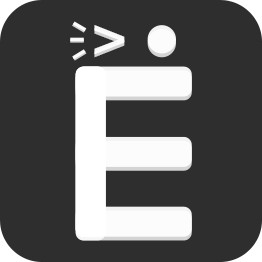

# Yo-typing (version 2.1.2) 

Live demo is available at: https://yo-typing.ru

## Table of Contents

- [Overview](#overview)
- [Built With](#built-with)
- [Features](#features)

## Overview

This repo hosts **exclusively backend** code for yo-typing - a competitive
online game with an accent put on words using cyrillic letter "Ё" present.

### Built With

- [Django (v4.1.6)](https://www.djangoproject.com)
- [Django Rest Framework (v3.14.0)](https://django-rest-framework.org/)
- [Django Channels (v4.0.0)](https://github.com/django/channels)

### Word from developer

The project was refactored to the current state with the aim of learning and following
more closely both general and django-specific coding guidelines
and best practices adopted by the community.

<u>Specific accent was put on:</u>
- Adopting the test-driven approach for every piece of code written.
- Extracting business logic from code and keeping it in models
  exclusively (as one widely-supported alternative).
- Keeping logic that is unrelated to websockets (e.g. actual game
  mechanics) as separate as possible from the websocket consumer
  code.
- Optimizing database queries and leveraging aggregations instead of
  unneeded denormalization to improve both data integrity and code
  maintainability.

## Features

This application can help by improving your typing speed while also
providing fun competition experience in the multiplayer with your friends!

You can also keep track of your stats (average and best typing speed +
more) if you sign up, as well as take place of honor in the leaderboard
among the others if you do 🐈

Modes available currently are:
* **Classic** - each player gets a common set of words and 60 seconds to
  type them accurately. Whoever gets the most points wins!
* **Ironwall** - same as classic, however backspace is disabled, so be
  careful! Can be used to improve typing accuracy.
* **Endless** - only 30 seconds are given, however you *can* take them back
  by entering the words properly, and the word amount is infinite! At the
  same time, the clock has also an advantage of ticking faster at every moment, so
  don't let it get too much ahead. Last player standing wins!
* **Tug Of War** - team vs team! Type as many of the words correctly as
  fast as you can and get ahead of the opposite team by pulling the tug
  on your side! Team points difference is what gets you a win.
